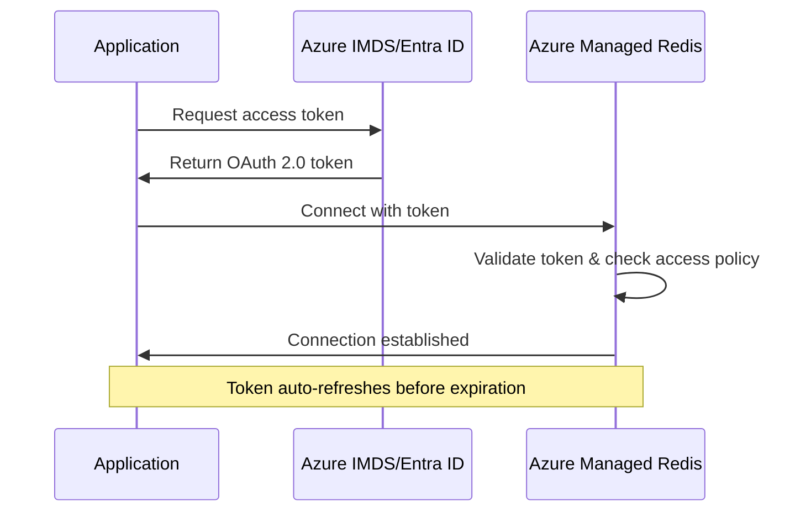

# Azure Managed Redis - Entra ID Authentication Examples

[](https://opensource.org/licenses/MIT)
[](https://azure.microsoft.com/en-us/products/managed-redis)

> **Comprehensive guide and working examples for implementing Microsoft Entra ID (formerly Azure AD) authentication with Azure Managed Redis across all supported programming languages.**

## 🎯 Purpose

This repository provides:

1. **Theoretical understanding** of how Entra ID authentication works with Azure Managed Redis
2. **Step-by-step workflow** documentation
3. **Working code examples** for every officially supported language/client
4. **Best practices** and troubleshooting guides

## 📚 Supported Languages & Client Libraries

| Language | Client Library | Entra ID Package | Status |
|----------|---------------|------------------|--------|
| [Python](./examples/python/) | redis-py | redis-entraid | ✅ Complete |
| [Java (Jedis)](./examples/java-jedis/) | Jedis | redis-authx-entraid | ✅ Complete |
| [Java (Lettuce)](./examples/java-lettuce/) | Lettuce | redis-authx-entraid | ✅ Complete |
| [Java (Lettuce + Spring Boot)](./examples/java-lettuce-springboot/) | Lettuce + Spring Boot | redis-authx-entraid | ✅ Complete |
| [Node.js](./examples/nodejs/) | node-redis | @redis/entraid | ✅ Complete |
| [Go](./examples/go/) | go-redis | go-redis-entraid | ✅ Complete |
| [.NET/C#](./examples/dotnet/) | StackExchange.Redis | Microsoft.Azure.StackExchangeRedis | ✅ Complete |

> **Note:** The Spring Boot example includes critical configurations for **Cluster OSS** mode, including `MappingSocketAddressResolver` and Azure best practices for topology refresh.

## 🏗️ Repository Structure

```
azure-managed-redis-entra-id-auth/
├── README.md                           # This file
├── LICENSE
├── CONTRIBUTING.md
├── docs/
│   ├── HOW_IT_WORKS.md                # Deep dive into Entra ID auth flow
│   ├── AUTHENTICATION_FLOW.md          # Step-by-step workflow
│   ├── AZURE_SETUP.md                  # Azure configuration guide
│   ├── MANAGED_IDENTITIES.md           # Managed identity types explained
│   ├── SERVICE_PRINCIPALS.md           # Service principal setup
│   ├── ACCESS_POLICIES.md              # Access policy configuration
│   ├── TROUBLESHOOTING.md              # Common issues and solutions
│   └── diagrams/                       # Architecture and flow diagrams
│       ├── auth-flow.png
│       └── token-lifecycle.png
├── infrastructure/
│   ├── terraform/                      # Terraform templates
│   │   ├── main.tf
│   │   ├── variables.tf
│   │   ├── outputs.tf
│   │   └── README.md
│   └── bicep/                          # Bicep templates
│       ├── main.bicep
│       └── README.md
├── examples/
│   ├── python/
│   │   ├── README.md
│   │   ├── requirements.txt
│   │   ├── managed_identity_example.py
│   │   ├── service_principal_example.py
│   │   └── flask_app_example/
│   ├── java-jedis/
│   │   ├── README.md
│   │   ├── pom.xml
│   │   └── src/
│   ├── java-lettuce/
│   │   ├── README.md
│   │   ├── pom.xml
│   │   └── src/
│   ├── java-lettuce-springboot/        # Spring Boot + Cluster OSS example
│   │   ├── README.md
│   │   ├── pom.xml
│   │   └── src/
│   ├── nodejs/
│   │   ├── README.md
│   │   ├── package.json
│   │   ├── managed_identity_example.js
│   │   └── service_principal_example.js
│   ├── go/
│   │   ├── README.md
│   │   ├── go.mod
│   │   ├── managed_identity_example.go
│   │   └── service_principal_example.go
│   └── dotnet/
│       ├── README.md
│       ├── EntraIdAuth.csproj
│       └── Program.cs
├── infra/                              # Azure Developer CLI (azd) templates
│   ├── README.md
│   ├── main.bicep
│   ├── main.parameters.json
│   ├── modules/
│   │   ├── managed-identity.bicep
│   │   ├── vnet.bicep
│   │   ├── redis.bicep
│   │   └── vm.bicep
│   └── scripts/
│       └── install-runtimes.sh
└── scripts/
    ├── setup-azure.sh                  # Azure resource setup
    └── test-connection.sh              # Connection testing
```

## 🧪 Automated Testing with Azure Developer CLI (azd)

This repository includes infrastructure-as-code for deploying a complete test environment using `azd`.

### Deploy Test Environment

```bash
# Login to Azure
azd auth login

# Deploy everything (Redis + VM with all runtimes)
azd up

# Get connection info
azd env get-values
```

### Run Tests on the VM

```bash
# SSH to the VM
ssh azureuser@<vm-public-ip>

# Clone examples and run tests
git clone <this-repo> ~/redis-examples
export AZURE_CLIENT_ID="<from azd outputs>"
export REDIS_HOSTNAME="<from azd outputs>"
./run-tests.sh all
```

See [infra/README.md](./infra/README.md) for detailed instructions.

## 🚀 Quick Start

### Prerequisites

1. **Azure Subscription** with permissions to create resources
2. **Azure Managed Redis** instance (or Azure Cache for Redis Enterprise)
3. One of the following authentication methods configured:
   - **Managed Identity** (recommended for Azure-hosted apps)
   - **Service Principal** (for local development or non-Azure environments)

### Step 1: Set Up Azure Resources

See [docs/AZURE_SETUP.md](./docs/AZURE_SETUP.md) for detailed instructions.

### Step 2: Choose Your Language

Navigate to the example directory for your language and follow the README:

- [Python Examples](./examples/python/)
- [Java (Jedis) Examples](./examples/java-jedis/)
- [Java (Lettuce) Examples](./examples/java-lettuce/)
- [Node.js Examples](./examples/nodejs/)
- [Go Examples](./examples/go/)
- [.NET Examples](./examples/dotnet/)

## 📖 Understanding Entra ID Authentication

### The Big Picture

Traditional Redis authentication uses access keys (passwords), which have security risks:
- Keys can be leaked or compromised
- Manual rotation is required
- No audit trail of who accessed what

**Entra ID authentication** eliminates these risks by using **identity-based, token authentication**:
- ✅ No passwords to manage
- ✅ Automatic token rotation
- ✅ Full audit trail
- ✅ Centralized access control

### Authentication Flow Overview



For detailed explanations, see:
- [How It Works](./docs/HOW_IT_WORKS.md)
- [Authentication Flow](./docs/AUTHENTICATION_FLOW.md)

## 🔑 Key Concepts

### 1. Managed Identities vs Service Principals

| Type | Use Case | Secrets Required |
|------|----------|------------------|
| **System-assigned Managed Identity** | Azure-hosted apps (App Service, Functions, VMs) | None |
| **User-assigned Managed Identity** | Multiple apps sharing the same identity | None |
| **Service Principal** | Local development, CI/CD, non-Azure environments | Client secret or certificate |

### 2. Access Policy Assignment

> ⚠️ **Critical**: Azure Managed Redis requires an **access policy assignment** for authentication to work. This is different from RBAC role assignments!

```hcl
# Terraform example (using AzAPI provider)
resource "azapi_resource" "redis_access_policy" {
  type      = "Microsoft.Cache/redisEnterprise/databases/accessPolicyAssignments@2024-10-01"
  name      = "app-identity"
  parent_id = azurerm_managed_redis.main.database_id
  
  body = jsonencode({
    properties = {
      accessPolicyName = "default"  # Must be "default" for Azure Managed Redis
      user = {
        objectId = azurerm_user_assigned_identity.app.principal_id
      }
    }
  })
}
```

### 3. Token Lifecycle

All supported client libraries handle token management automatically:
- Initial token acquisition
- Token caching
- Automatic refresh before expiration (~1 hour lifetime)
- Retry logic for transient failures

## 🛡️ Security Benefits

| Feature | Password Auth | Entra ID Auth |
|---------|--------------|---------------|
| **Secrets** | Must store/rotate passwords | No secrets needed |
| **Expiration** | Manual rotation required | Auto-renewed tokens |
| **Audit** | Limited | Full Azure AD audit trail |
| **Revocation** | Change password everywhere | Revoke identity access |
| **Zero Trust** | Password can leak | Identity-based, time-limited |

## 📚 Additional Resources

### Official Documentation
- [Microsoft Learn: Entra ID for Azure Managed Redis](https://learn.microsoft.com/en-us/azure/azure-cache-for-redis/managed-redis/managed-redis-entra-for-authentication)
- [Redis.io Client Documentation](https://redis.io/docs/latest/develop/clients/)

### Client Library Repositories
- [redis-py-entraid (Python)](https://github.com/redis/redis-py-entraid)
- [jvm-redis-authx-entraid (Java)](https://github.com/redis/jvm-redis-authx-entraid)
- [@redis/entraid (Node.js)](https://github.com/redis/node-redis/tree/master/packages/entraid)
- [go-redis-entraid (Go)](https://github.com/redis/go-redis-entraid)
- [Microsoft.Azure.StackExchangeRedis (.NET)](https://github.com/Azure/Microsoft.Azure.StackExchangeRedis)

## 🤝 Contributing

Contributions are welcome! Please read [CONTRIBUTING.md](./CONTRIBUTING.md) for guidelines.

## 📄 License

This project is licensed under the MIT License - see [LICENSE](./LICENSE) for details.

## 🙏 Acknowledgments

- Microsoft Azure Redis team
- Redis Inc. client library maintainers
- Community contributors
